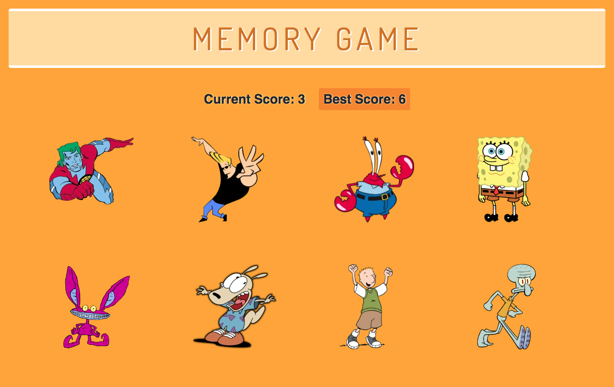

# Memory Game

#### React breaks up this application's UI into components, manages its component state and responds to user events to create a Nickelodeon-themed memory game.

### Overview
* This application renders images of different Nickelodeon characters to the screen. Each character listens for click events.
* The app keeps track of the user's score. 
* The user's score is incremented when clicking a character for the first time. 
* The user's score is reset to 0 if the user clicks the same character more than once.
* Every time a character is clicked, the characters shuffle themselves in a random order.
* Once the user's score is reset after an incorrect guess, the game restarts.

### > __Try it Out:__
